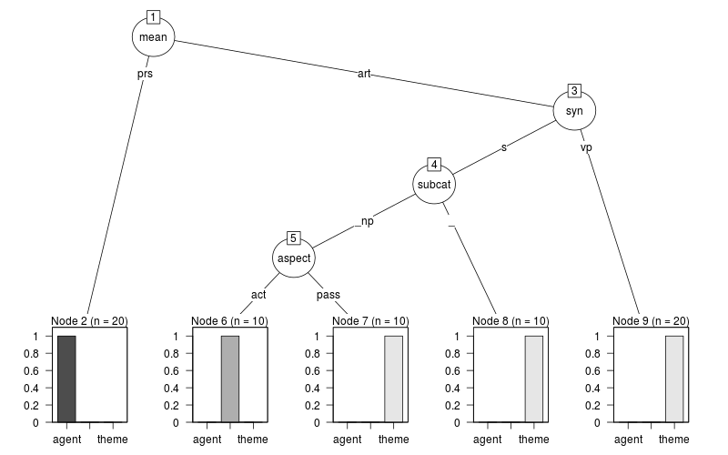

# 課題 {-}

* 意味役割を注釈した以下のようなコーパスがある。
  ここから、述語 "break"についての意味役割付与を学習し、
  その結果を決定木で表現せよ。

# 回答

意味役割(`thema`)の学習には以下の情報を用いる。

* `mean`:句の主辞の意味分類(person(prs)/artifact(art))
    * 風はartifactではない気がするが、personに対するカテゴリーとして設ける。
* `syn`:句の母親の統語分類(s/vp)
* `aspect`:文の態(active(act)/passive(pass))
* `subcat`:述語の下位範疇化情報(_/np/pp)

学習にはrpartパッケージ(不純度のデフォルトはジニ分散指標)を用いた。
独立変数に意味(mean)、統語分類(syn)、態(aspect)と下位範疇化情報(subcat)
を与え、従属変数には意味役割(thema)を置いた。

```r
corpus <- data.frame(
  thema =c("theme","agent","theme","force","theme","theme","agent"),
  mean  =c("art"  ,"prs"  ,"art"  ,"art"  ,"art"  ,"art"  ,"prs"  ),
  syn   =c("s"    ,"s"    ,"vp"   ,"s"    ,"vp"   ,"s"    ,"vp"   ),
  aspect=c("act"  ,"act"  ,"act"  ,"act"  ,"act"  ,"pass" ,"pass" ),
  subcat=c("_"    ,"_np"  ,"_np"  ,"_np"  ,"_np"  ,"_np"  ,"_pp"  ))

d = do.call("rbind", replicate(10, corpus, simplify = FALSE))
# 学習
library("rpart")
dt=rpart(thema~.,data=d, method = "class")
# 描写
# png("plot1.png", width = 800, height = 500)
library("partykit")
plot(as.party(dt))
# dev.off()
```

その結果、以下の決定木が得られる。
終端ノードは左からagent, force, themeとなっており、
非終端ノードには特徴に関する質問が与えられている。
最初のノードでは句の主辞の意味分類を問い、
personならばagentを与えている。
これはコーパスの例と合う結果である。
また、次のノードでは句の母親の統語分類を問い、
vpならば(つまり当該の句が与える対象の意味がpersonではなく、
かつvpならば)themeを与えている。
これは "Tom broke a glass"の "glass"に該当する。
次に問うのは述語の下位範疇化情報であり、
その次に態を問うことで意味役割を学習している。


